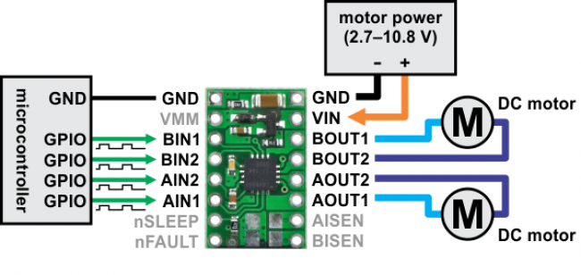

# The raspi-car

Mini car controlled by a raspberry pi with 2 motors on either side.

This car is controlled by ssh and drives through the use of keys being inputted by the standard input.

## What is needed?

* raspberry pi 4
* motor controller. ex. drv8833
* 2 DC motors. ex. MOT-TT-90:1
* 4 male to female jump wires
* 6 male to male jump wires
* 1 breadboard
* 2.7 - 10.8 V battery or equivalent(If the battery exceeds the voltage you can use a voltage divider or zenerdiode to reduce this.)
* Electric cable for raspberry pi or powerbank with an output of at least 2.1 mAH to give it enough juice.

## Setup raspberry pi

1. Connect the a female to male gpio pin on the following gpio pins:
	* 14
	* 15
	* 23
	* 24
2. Connect male gpio pins to the breadboard and make sure that the 14 and 15 control a motor and 23 and 24 control a motor.
	* It is important to do this correctly otherwhise you could move in the wrong direction.

3. Execute this below script to download and compile the necessary binary:
```
git clone https://github.com/mich2000/raspi-car;
cd raspi-car;
cargo build --release;
```
4. Go in the rust raspi-car project and execute: `target/release/raspi-car`
5. Press h and then enter to get all the commands that you can do with the car.

## Power-saving techniques for raspberry pi 4

* Disable hdmi: `/usr/bin/tvservice -o`
* Disable power led on the raspberry pi: `su -c 'echo 0 > /sys/class/leds/led1/brightness' root`

* Enable hdmi: `/usr/bin/tvservice -p`
* Enable power led on the raspberry pi: `su -c 'echo 255 > /sys/class/leds/led1/brightness' root`

## Ideas

* Use hotspot of computer that has a wifi and hotspot capability, so you don't even need an intermediate wifi.
* Build a 3d-printed encasing for more efficiency and more beautifull result.
* Use raspberry pi zero series board for smaller footprint and lower weight, just make sure there is a possibility to get wifi on it.
